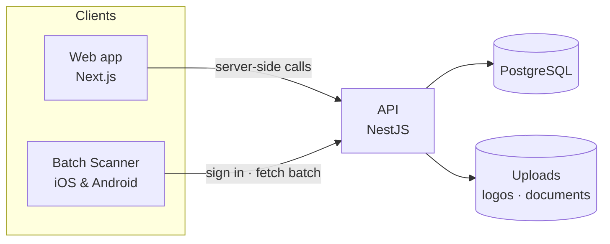

<h1 align="center">Restaurant Operations Management System</h1>

<p align="center">
  <b>Run the whole restaurant group from one place</b><br>
  Staff and rosters · tips · stock · the bar · events · food preservation · checklists · reports
</p>

<p align="center">
  
  
  
  
  
</p>

---

## Why teams use it

| | |
|---|---|
| **One login per person** | Every employee signs in with their own account. Nobody shares a password. |
| **See only what you need** | Roles and branch access decide every screen and every action. |
| **Nothing goes unrecorded** | Every change is in the audit log: who did it, what changed, and when. |
| **Multi-branch ready** | Each branch keeps its own stock, rosters and tips, and a manager can oversee several. |
| **Print-ready** | Reports print cleanly on A4, and batch stickers print with a QR code. |
| **Works on a phone** | A companion app scans batch QR codes on iOS and Android. |

---

## Modules

<details open>
<summary><b>Dashboard</b> — the morning view</summary>

- Key figures for your role, plus the status of every operation
- Trends and attendance charts
- Your own tip amount and today's checklist
</details>

<details>
<summary><b>Roster & attendance</b> — who works when</summary>

- Departments, positions, employees (each with a login), shift templates
- Weekly or monthly roster periods: build as a draft, publish to lock
- Attendance by day, leave requests with approvals, employee documents
</details>

<details>
<summary><b>Tip sharing</b> — fair, traceable tips</summary>

- Daily pools with participants and percentage shares
- Calculate once, then the amounts are final
- Payouts, personal balances, and three tip reports (exportable)
</details>

<details>
<summary><b>Inventory & item requests</b> — stock you can trust</summary>

- Items, categories, suppliers, warehouses, stock levels and movements
- Stock in, out, adjustments, transfers, wastage and purchase orders
- Kitchen staff request items; a manager approves, and the stock moves at once
</details>

<details>
<summary><b>Bar</b> — fast service, honest counts</summary>

- Recipes with ingredients; one tap records a sale and deducts stock
- Stock issue, counts and reconciliation with variances highlighted in red
</details>

<details>
<summary><b>Events</b> — from request to profit</summary>

- Status workflow: requested → confirmed → completed → closed
- Customers, venues, packages, staff assignments and expenses
- Automatic profit and loss, with a manual revenue override when needed
</details>

<details>
<summary><b>Food preservation</b> — every batch, every day</summary>

- Batches with use-by dates, storage locations and the people who prepared them
- **Colour-coded by day:** Monday yellow, Tuesday blue, Wednesday red, and so on
- **QR stickers** that open the batch in the mobile app
- Full history per batch: recorded, used up, disposed, expired
- Temperature logs and disposal requests with approval
</details>

<details>
<summary><b>Checklists</b> — the routine, done</summary>

- Templates with ordered items and required reasons for "no" answers
- Each person sees today's checklist and answers it
- Completion records show what is still pending
</details>

<details>
<summary><b>Reports & audit</b> — proof for the books</summary>

- Filtered reports with CSV and Excel export and A4 print
- Full audit log of every change across the system
</details>

---

## Architecture



- **Web app** talks to the API from the server, so sign-in tokens never reach the browser.
- **API** enforces every permission and branch rule, whatever the screen shows.
- **Mobile app** uses the same sign-in and reads batch details.

---

## Quick start

<details open>
<summary><b>Windows — one command</b></summary>

1. Install **Node.js 20+** and **PostgreSQL 17** (or Docker Desktop).
2. Open PowerShell in this folder and run:

   ```powershell
   powershell -ExecutionPolicy Bypass -File scripts\install.ps1
   ```

3. Answer the few questions, wait for the build, then open **http://localhost:3000**.

Next time, run `scripts\start.ps1`. Full guide: [docs/installation-workflow.md](docs/installation-workflow.md).
</details>

<details>
<summary><b>Developers — run it by hand</b></summary>

```bash
# API
cd backend && npm ci && npm run start:dev      # http://localhost:3001

# Web app
cd frontend && npm ci && npm run dev           # http://localhost:3000

# Mobile (optional)
cd mobile && npx expo start
```

Copy `.env.example` to `.env` and fill it in first. Deployment details are in [docs/deployment-guide.md](docs/deployment-guide.md).
</details>

---

## Documentation

| Read this | If you want to… |
|---|---|
| [Business documentation](docs/business-documentation.md) | Understand what the system does and how each team uses it |
| [Installation workflow](docs/installation-workflow.md) | Set it up on a new computer or server |
| [Deployment guide](docs/deployment-guide.md) | Run it on a production server with HTTPS and Docker |
| [Module design notes](docs/module-structure.md) | See how the modules fit together |
| [RBAC design](docs/rbac-design.md) | Understand roles, permissions and branch access |

---

## Roadmap

- [x] Core modules: roster, tips, inventory, bar, events, preservation, checklists
- [x] Role-based access with branch scoping and privilege guards
- [x] Reports with CSV, Excel and A4 print
- [x] Batch QR stickers, day colours, history timeline
- [x] Batch Scanner app (iOS & Android)
- [x] One-command installation
- [ ] Browser walk-through of every screen before go-live
- [ ] Mobile app packaged for the app stores
- [ ] Automated tests in continuous integration
- [ ] Production hardening: HTTPS by default, schema migrations

---

## Contributing

1. Fork the repository and create a branch for your change.
2. Run the checks before opening a pull request:
   ```bash
   cd backend && npx tsc --noEmit && npm run build
   cd frontend && npx tsc --noEmit && npm run build
   ```
3. Describe what changed and why in the pull request.

---

<p align="center">
  <sub>Built for restaurant teams who want less paperwork and more certainty.</sub>
</p>
